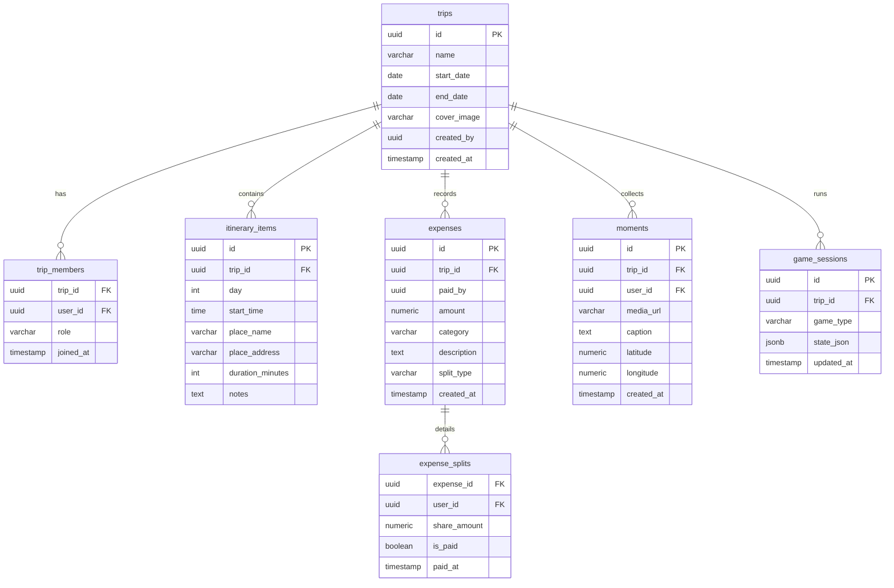
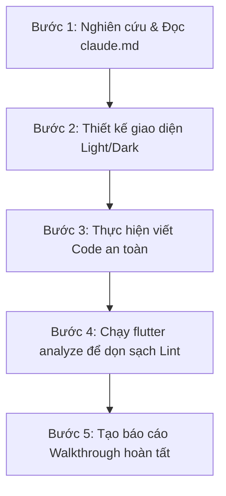

# 🛠️ AI Developer Playbook & Workspace Guidelines (claude.md)

Chào mừng bạn đến với tài liệu hướng dẫn phát triển tự động dành cho AI (Claude, Antigravity, và các tác nhân mã hóa khác). File này đóng vai trò là **Nguồn Sự Thật Duy Nhất (Single Source of Truth)** để định hình kiến trúc, quy trình làm việc, thiết kế giao diện và ngăn ngừa các lỗi ảo giác (hallucinations) trong suốt quá trình xây dựng dự án **TripMate**.

---

## 🎯 1. Tổng Quan Dự Án & Định Hướng Sản Phẩm
*   **Tên dự án:** TripMate (Super App Du Lịch Nhóm dành cho Gen Z).
*   **Khẩu hiệu:** Plan chill. Chia tiền ez. Lưu moment.
*   **Kiến trúc Mobile:** Flutter (Dart) - Giao diện cao cấp, mượt mà, micro-animations sinh động.
*   **Kiến trúc Backend:** Supabase (Auth, PostgreSQL Database, Storage, Realtime Sync).
*   **Tích hợp AI:** Claude API (Anthropic) cho các tính năng Vibe Match, Debt Roast, OCR.

---

## 🎨 2. Nguyên Lý Thiết Kế & Hệ Thống Giao Diện (Visual Guidelines)
Gen Z đòi hỏi một giao diện cực kỳ cá tính, sống động và mượt mà. Mọi màn hình được tạo hoặc chỉnh sửa phải tuân theo các nguyên tắc sau:

### ⚠️ QUY TẮC BẮT BUỘC TOÀN CẦU (USER GLOBAL RULES):
1.  **Luôn kiểm tra lỗi phân tích tĩnh (Lint Error)** sau mỗi lần chỉnh sửa mã nguồn bằng lệnh `flutter analyze`.
2.  **Mọi màn hình khi được tạo mới hoặc chỉnh sửa PHẢI tích hợp đồng thời cả hai chế độ Sáng và Tối (Light & Dark Theme)** một cách trực quan, đẹp mắt và có độ tương phản cao.

### 🎨 Bộ màu sắc tiêu chuẩn (Design Tokens)
| Thuộc tính màu sắc | Chế độ Sáng (Light Theme) | Chế độ Tối (Dark Theme) |
| :--- | :--- | :--- |
| **Primary (Chủ đạo)** | `Color(0xFFE0533C)` (Coral đỏ cam) | `Color(0xFF8B5CF6)` (Electric Purple tím) |
| **Secondary (Phụ trợ)** | `Color(0xFFEBA83A)` (Warm Amber vàng ấm) | `Color(0xFF06B6D4)` (Bright Teal xanh ngọc) |
| **Background (Nền)** | `Color(0xFFFCFAF6)` (Cream/Ivory ấm áp) | `Color(0xFF0B0F19)` (Obsidian đen sâu) |
| **Surface (Bề mặt thẻ)** | `Colors.white` (Trắng tinh khiết) | `Color(0xFF1E293B)` (Dark Slate Blue xanh đen) |
| **Text Primary (Chữ chính)** | `Color(0xFF1E2022)` (Charcoal than đậm) | `Color(0xFFF1F5F9)` (Ice White trắng đá) |
| **Text Secondary (Chữ phụ)** | `Color(0xFF686D76)` (Warm Slate xám đá) | `Color(0xFF94A3B8)` (Cool Grey xám lạnh) |

### ✍️ Nguyên tắc thiết kế Typography & Components:
*   **Font chữ:** Bo tròn hiện đại (`GoogleFonts.outfit` hoặc `GoogleFonts.plusJakartaSans`).
*   **Thẻ (Card):** Bo góc mạnh (`borderRadius: BorderRadius.circular(20)`), đổ bóng nhẹ bằng màu primary kết hợp độ mờ.
*   **Tương tác:** Bo góc nút bấm lớn (`BorderRadius.circular(16)`), sử dụng cử chỉ vuốt chạm (swipe, tap), tích hợp haptic feedback nếu cần.
*   **Chuyển động (Animations):** Sử dụng các widget có hoạt ảnh mặc định như `AnimatedContainer`, `AnimatedScale`, `AnimatedRotation` hoặc `AnimatedSwitcher` để tạo cảm giác giao diện "sống động".

---

## 🏗️ 3. Kiến Trúc Mã Nguồn Flutter (Directory Structure)

Thư mục chính tuân thủ mô hình **Feature-First (Theo tính năng)** giúp tách biệt rõ ràng các phân hệ của Super App:

```text
lib/
├── core/
│   ├── constants/             # Các hằng số màu sắc, văn bản toàn cục
│   └── theme/                 # Quản lý giao diện
│       ├── theme.dart         # Định nghĩa cấu hình ThemeData (Light/Dark)
│       └── theme_provider.dart# Quản lý trạng thái chuyển đổi chủ đề (ChangeNotifier)
└── features/
    ├── dashboard/             # Màn hình chính Explore và điều hướng BottomNavigationBar
    │   └── presentation/      # Giao diện Dashboard, Carousel điểm đến, active trips
    ├── trip_planner/          # Lập lịch trình chi tiết (Itinerary Builder)
    │   ├── domain/            # Models: Trip, Activity (chuẩn bị cho API)
    │   └── presentation/      # Giao diện dòng thời gian lịch trình (Timeline Node UI)
    └── expense_tracker/       # Thống kê chi tiêu & Chia tiền (Expense & Splitter)
        ├── domain/            # Models: Expense, Debt
        └── presentation/      # Giao diện ví chi tiêu, tiến độ vòng tròn ngân sách
```

---

## 🗄️ 4. Sơ Đồ Cơ Sở Dữ Liệu Supabase (Database Schema)

Dưới đây là thiết kế các bảng dữ liệu PostgreSQL trên Supabase để đồng bộ thời gian thực:



---

## 🛡️ 5. Nguyên Tắc Lập Trình Để Tránh Ảo Giác (Anti-Hallucination Rules)

Khi viết hoặc cập nhật mã nguồn cho dự án này, AI bắt buộc phải tuân theo các quy tắc nghiêm ngặt sau:

### 🚫 Quy tắc viết Code & Tránh Lỗi Phổ Biến:
1.  **Không sử dụng thuộc tính màu cũ bị cảnh báo deprecated:**
    *   ❌ Không dùng `withOpacity(val)` trên đối tượng `Color`.
    *   ✅ Bắt buộc dùng `.withValues(alpha: val)`.
    *   ❌ Không khai báo thuộc tính `background` hoặc `onBackground` trong cấu hình `ColorScheme`.
    *   ✅ Hãy dùng `surface` và `onSurface` để thay thế.
    *   ❌ Không dùng widget `CardTheme(...)` bên trong cấu hình `ThemeData`.
    *   ✅ Bắt buộc dùng `CardThemeData(...)` thay thế.
2.  **Ràng buộc kiểu dữ liệu rõ ràng:**
    *   Tránh các lỗi ép kiểu ngầm định khi xử lý Map/List động. Luôn thực hiện ép kiểu an toàn, ví dụ: `gradient: dest['gradient'] as List<Color>`.
3.  **Tương thích với Widget Tests:**
    *   Khi thay đổi cấu trúc màn hình hoặc widget trong `main.dart`, hãy kiểm tra và cập nhật file kiểm thử [widget_test.dart](file:///e:/TripMate/test/widget_test.dart) để tránh lỗi kiểm thử khói (smoke test).
4.  **Bảo toàn chú thích (Preserve Comments):**
    *   Không tự ý xóa bỏ các comment giải thích kiến trúc hoặc ghi chú thiết kế của nhà phát triển trước đó trừ khi được yêu cầu thay thế trực tiếp.

---

## 🔄 6. Quy Trình Phát Triển Từng Bước Của AI (AI Agent Workflow)

Mỗi khi nhận được yêu cầu viết mã nguồn hoặc nâng cấp tính năng mới, AI cần thực hiện tuần tự theo quy trình 5 bước sau:



### 📋 Mô tả chi tiết từng bước:

*   **Bước 1: Nghiên cứu (Research Phase)**
    *   Đọc kỹ file `claude.md` này để hiểu phong cách thiết kế và sơ đồ cơ sở dữ liệu.
    *   Kiểm tra sự nhất quán của mã nguồn hiện tại trong thư mục `lib/`.
*   **Bước 2: Thiết kế (Design Phase)**
    *   Lập sơ đồ cấu trúc của Widget/Screen cần viết.
    *   Xác định rõ ràng mã màu Sáng và Tối sẽ sử dụng (không dùng mã màu ngẫu nhiên ad-hoc ngoài bộ màu tiêu chuẩn).
*   **Bước 3: Triển khai (Implementation Phase)**
    *   Sử dụng các công cụ chỉnh sửa mã nguồn có phạm vi khoanh vùng hẹp nhất như `multi_replace_file_content` thay vì ghi đè toàn bộ file lớn để tối ưu hóa tài nguyên.
    *   Đảm bảo không tạo ra các import dư thừa hoặc sai đường dẫn.
*   **Bước 4: Xác thực (Verification Phase)**
    *   Bắt buộc chạy lệnh terminal `flutter analyze` tại thư mục dự án `e:\TripMate`.
    *   **TIÊU CHUẨN HOÀN THÀNH:** Báo cáo phân tích phải hiển thị: **`No issues found!`**. Nếu xuất hiện bất kỳ cảnh báo Info/Warning/Error nào, AI phải tự động sửa chữa ngay lập tức cho đến khi sạch lỗi.
*   **Bước 5: Báo cáo (Reporting Phase)**
    *   Cập nhật tệp báo cáo [walkthrough.md](file:///C:/Users/ASUS/.gemini/antigravity/brain/520bb115-e6a4-4655-bf1b-33ba160f288e/walkthrough.md) để mô tả rõ ràng các thay đổi đã thực hiện và phương thức xác thực cho lập trình viên (User).
